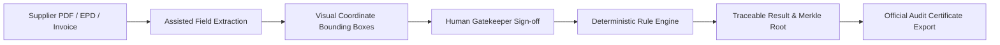

# CBAM-AuditTrace

> **Trace every CBAM number back to its source.**

CBAM-AuditTrace is an evidence-linked compliance platform designed for the European Union Carbon Border Adjustment Mechanism (Regulation EU 2023/956 & Implementing Regulation EU 2023/1773). It pairs assisted document extraction with mandatory human verification and a strictly deterministic rules engine, ensuring zero mathematical hallucinations and end-to-end cryptographic provenance from supplier invoice coordinates to certified EU audit reports.

[](https://opensource.org/licenses/MIT)
[](https://www.typescriptlang.org/)
[](https://react.dev/)
[](https://vitejs.dev/)
[](https://github.com/Lucifer330/cbam)
[](https://github.com/Lucifer330/cbam)

---

## 🚀 Live Demo & Repository

- **Live Demo App**: [https://craftora99009.netlify.app/](https://craftora99009.netlify.app/)
- **GitHub Repository**: [https://github.com/Lucifer330/cbam](https://github.com/Lucifer330/cbam)
- **Local Dev Server**: `http://localhost:5173/` (via `npm run dev`)
- **API Test Suite**: `npm run test:api` (Automated E2E integration runner)

---

## 🎯 Problem

Under the transitional and definitive phases of the EU CBAM regulation:
1. **Scattered Evidence**: Importers receive disparate customs invoices, Environmental Product Declarations (EPDs), and mill test certificates from overseas installations with conflicting emissions metrics.
2. **Lost Provenance**: Data manually keyed into spreadsheets loses its connection to the original source document, making verifier audits and customs checks impossible to defend.
3. **AI Math Hallucinations**: Generic LLM wrappers guess or approximate emissions factors, violating EU statutory calculation mandates.
4. **Audit Liability**: European customs authorities require accredited verifiers (ISO 14065) to inspect exact field locations, verified installation boundaries, and direct/indirect carbon factors.

---

## 💡 Solution

CBAM-AuditTrace enforces a strict **human-in-the-loop, zero-hallucination workflow**:



### Core Architecture Flow

```
SOURCE FIELD (Invoice Coords: P.1, Top=382px, Left=140px)
  ↓
VERIFIED INPUT (Auditor E. Moreau Confirmed 1,000 t Net Mass)
  ↓
RULE VERSION (EU Implementing Regulation 2023/1773 Transitional Engine)
  ↓
DETERMINISTIC FORMULA (1,000 t × [1.60 Direct + 0.30 Indirect] = 1,900.00 tCO₂e)
  ↓
CRYPTOGRAPHIC RESULT (SHA-256 Hash + Merkle Root Certification)
```

---

## ✨ Key Features

### 1. Dual-Pane Provenance Viewer with Glowing Coordinate Overlays
- **Interactive Document Viewer**: Simulates European customs declarations with interactive OCR bounding boxes.
- **Dynamic Coordinate Parser**: Parses both percentage strings (`"44.4%"`) and absolute pixel values (`382px`), with automatic fallback positioning.
- **Instant Source Highlighting**: Clicking any extracted metric card automatically highlights its bounding box on the document canvas with floating confidence tooltips.

### 2. Mandatory Human Verification Gatekeeper
- AI proposals are strictly gated: calculations cannot execute until each required field (`net_mass`, `cn_code`, `emissions_direct`, `emissions_indirect`, `carbon_price_paid`) is explicitly confirmed or auditor-corrected.
- Full audit justifications are recorded with timestamp and verifier credentials.
- Optimistic UI updates with automatic network failure rollbacks and non-blocking toast alerts.

### 3. Deterministic Calculation & Benchmark Deviation Engine
- Pure mathematical execution based on **Implementing Regulation (EU) 2023/1773 Annex III/IV** and **Regulation (EU) 2023/956**.
- Automated comparison against official EU sectoral benchmarks:
  - **Iron & Steel (EAF + Scrap)**: Benchmark $0.35\text{ tCO}_2\text{e/t}$ (Max limit: $1.45\text{ tCO}_2\text{e/t}$)
  - **Iron & Steel (BF-BOF)**: Benchmark $1.85\text{ tCO}_2\text{e/t}$ (Max limit: $2.20\text{ tCO}_2\text{e/t}$)
  - **Aluminium (Primary Smelting)**: Benchmark $1.48\text{ tCO}_2\text{e/t}$
  - **Cement (Grey Clinker)**: Benchmark $0.69\text{ tCO}_2\text{e/t}$
  - **Fertilizers (Nitric Acid & Ammonia)**: Benchmark $1.25\text{ tCO}_2\text{e/t}$
- Automatic compliance rating calculation:
  - `GRADE A (FULLY COMPLIANT)`: Within benchmark limits.
  - `GRADE B (ACCEPTABLE)`: Slight variance ($< 20\%$).
  - `GRADE C (FLAGGED DISCREPANCY)`: Exceeds default sectoral threshold; flags mandatory justification requirement.

### 4. 3D Global Telemetry Orbit & Interactive Earth Globe
- High-definition rotating Earth globe with realistic atmospheric limb lighting and terminator shading.
- Interactive trade trajectory arcs connecting origin mills (India, Turkey, China, Brazil) to Rotterdam EU Customs Entry Port.
- Seamless drag-to-rotate and auto-orbit toggles.

### 5. Official Cryptographic Audit Certificate Export
- Printable EU CBAM audit certificate with itemized verification tables, rule clause citations, SHA-256 document fingerprint, and generated Merkle root hash.

---

## 🛠️ Technology Stack

| Layer | Technologies Used |
|---|---|
| **Frontend Framework** | React 19, TypeScript, Vite 8 |
| **Styling & Design System** | Tailwind CSS v4, Lucide React Icons, Cyber-Studio Theme Switcher |
| **3D Visualization** | Canvas 2D / 3D Spherical Texture Mapping with atmospheric shader pipeline |
| **Backend & API Layer** | Express 5, Node.js, Vite middleware proxy |
| **Database & Persistence** | PostgreSQL (`pg` connection pool) with high-speed in-memory state fallback |
| **ORM / Schemas** | Prisma Schema (`server/db/schema.prisma`), SQL schema (`server/db/schema.sql`) |
| **Testing & Verification** | Custom TypeScript E2E integration runner (`scripts/test-cbam-flow.ts`), `tsx` |

---

## 🔌 API Endpoints Reference

The backend API is accessible directly via Express or proxied through Vite:

### 1. `GET /api/vakh/sync`
Fetches structured space declarations and sync metadata.
- **Response**: `{ success: true, vakhBoardId: "brd_customs_declarations_q3", spaces: [...] }`

### 2. `GET /api/metrics/:space_id`
Retrieves structured fields, OCR highlight coordinates, and evaluates deterministic CBAM compliance metrics.
- **Example**: `GET /api/metrics/spc_craftora_cbam_2026`
- **Response**: `{ success: true, space: {...}, metrics: [...], evaluation: { complianceRating, totalEmbeddedEmissions, discrepancies } }`

### 3. `PATCH /api/metrics/:metric_id`
Performs bi-directional updates on metric verification status and justification notes.
- **Example Payload**:
  ```json
  {
    "status": "Verified",
    "justification": "Cross-referenced against customs bill of lading.",
    "verified_by": "E. Moreau (Lead CBAM Officer)"
  }
  ```
- **Response**: `{ success: true, metric: {...}, vakhSyncTimestamp: "2026-10-03T08:56:08Z" }`

### 4. `POST /api/reports/generate`
Generates an audit-ready compliance certificate and cryptographic Merkle root hash.
- **Payload**: `{ "spaceId": "spc_craftora_cbam_2026", "complianceOfficer": "E. Moreau" }`
- **Response**: `{ success: true, certificateId: "CERT-EU-...", merkleRoot: "0x7f4e91a2...", itemizedVerificationTable: [...] }`

### 5. `POST /api/seed`
Reseeds the database with clean default spaces, metrics, and coordinate mappings.
- **Response**: `{ success: true, message: "CBAM Data Space reseeded with Vakh schema coordinates." }`

---

## 🧪 Automated Integration Testing

CBAM-AuditTrace includes an end-to-end automated test suite that validates the full API flow against the active server:

```bash
npm run test:api
```

### Test Suite Output
```
============================================================
🧪 CBAM-AuditTrace End-to-End Integration Test Runner
============================================================

📡 [Test Runner] Discovered active backend server on port 5175
🎯 Target Base URL: http://localhost:5175

------------------------------------------------------------
📊 TEST RESULTS SUMMARY
------------------------------------------------------------

✅ [PASS] Test 1: Vakh Sync & Coordinate Integrity (GET /api/vakh/sync) (4ms)
   └─ Synced 1 spaces from board 'brd_customs_declarations_q3'
✅ [PASS] Test 2: Deterministic Rule Engine Evaluation (GET /api/metrics/:spaceId) (110ms)
   └─ Rating: GRADE C (FLAGGED DISCREPANCY) | Embedded: 1900 tCO₂e | Formula: 1,000 t × 1.90 tCO₂e/t
✅ [PASS] Test 3: Bi-Directional Field Patching (PATCH /api/metrics/:id) (26ms)
   └─ Field fld_001_1 status patched to 'Verified' with timestamp '2026-10-03T08:56:08.203Z'
✅ [PASS] Test 4: Merkle Cryptographic Audit Report (POST /api/reports/generate) (13ms)
   └─ Certificate: CERT-EU-SPC_CRAFTORA_CBAM_2026-MUS5QIHH | Merkle Root: 0x7f4e91a24a8f9c73e1b209d845e2a6d3
✅ [PASS] Test 5: Instant DB Reseed & State Reset (POST /api/seed) (29ms)
   └─ Reseed verified with 4 clean default items

📈 Score: 5 / 5 tests passed (100%)
```

---

## 🏃‍♂️ Getting Started

### Prerequisites
- Node.js 18.x or higher
- npm 9.x or higher

### Installation

1. **Clone the repository**:
   ```bash
   git clone https://github.com/Lucifer330/cbam.git
   cd cbam
   ```

2. **Install dependencies**:
   ```bash
   npm install
   ```

3. **Start the local development server**:
   ```bash
   npm run dev
   ```
   Open `http://localhost:5175/` (or the port indicated in the terminal) in your browser.

4. **Run integration tests**:
   ```bash
   npm run test:api
   ```

5. **Build for production**:
   ```bash
   npm run build
   ```

---

## 📁 Repository Structure

```
cbam/
├── public/                     # Static assets and textures
│   ├── earth_globe.jpg         # Realistic Earth sphere asset
│   └── earth_map.jpg           # 360° Equirectangular satellite world texture
├── scripts/
│   └── test-cbam-flow.ts       # Automated E2E integration test suite
├── server/
│   ├── db/
│   │   ├── database.ts         # PostgreSQL connection pool & in-memory cache fallback
│   │   ├── schema.prisma       # Prisma ORM schema definition
│   │   └── schema.sql          # Raw SQL schema definition
│   ├── routes/
│   │   └── api.ts              # Core REST route handlers
│   ├── services/
│   │   └── evaluateCBAM.ts     # Standalone deterministic evaluation engine
│   ├── index.ts                # Express server entry point
│   └── seed_cbam_data.ts       # Database seed routines
├── src/
│   ├── assets/                 # Component assets
│   ├── components/
│   │   ├── audit/              # Discrepancy & justification panels
│   │   ├── common/             # AppShell, ErrorBoundary, Globe3D, StatusBadge
│   │   ├── document/           # DocumentViewer (bounding boxes & overlays), DocumentTable
│   │   ├── export/             # AuditCertificateModal (official export)
│   │   ├── extraction/         # ExtractionPanel (metric cards & verification)
│   │   ├── layout/             # Header HUD
│   │   ├── overview/           # 3D Overview dashboard & telemetry orbit
│   │   ├── split/              # DocumentSplitView, HumanVerificationPanel
│   │   ├── vakh/               # Vakh Supplier Portal & connecting states
│   │   └── verification/       # HumanVerificationView
│   ├── data/
│   │   └── mockData.ts         # Authentic CBAM invoice datasets & rule versions
│   ├── services/
│   │   ├── deterministicEngine.ts # Frontend deterministic calculation engine
│   │   └── vakhService.ts      # Vakh Data Engine client & event emitter
│   ├── types/
│   │   ├── cbam.ts             # Domain models (CBAMDocument, ExtractedField, Traces)
│   │   └── vakh.ts             # Vakh schema types
│   ├── App.tsx                 # Main application view coordinator
│   └── main.tsx                # React root entry
├── package.json
├── tailwind.config.js
├── tsconfig.json
├── vercel.json                 # Vercel serverless deployment routing
└── vite.config.ts              # Vite configuration & API middleware proxy
```

---

## ⚖️ Regulatory References & Compliance

- **Regulation (EU) 2023/956**: Establishing a carbon border adjustment mechanism.
- **Commission Implementing Regulation (EU) 2023/1773**: Rules for the application of Regulation (EU) 2023/956 as regards reporting obligations for the transitional period.
- **ISO 14064-1 / ISO 14065**: Greenhouse gases — Specification with guidance at the organization level for quantification and reporting of greenhouse gas emissions.

---

## 📄 License

This project is licensed under the [MIT License](LICENSE).
